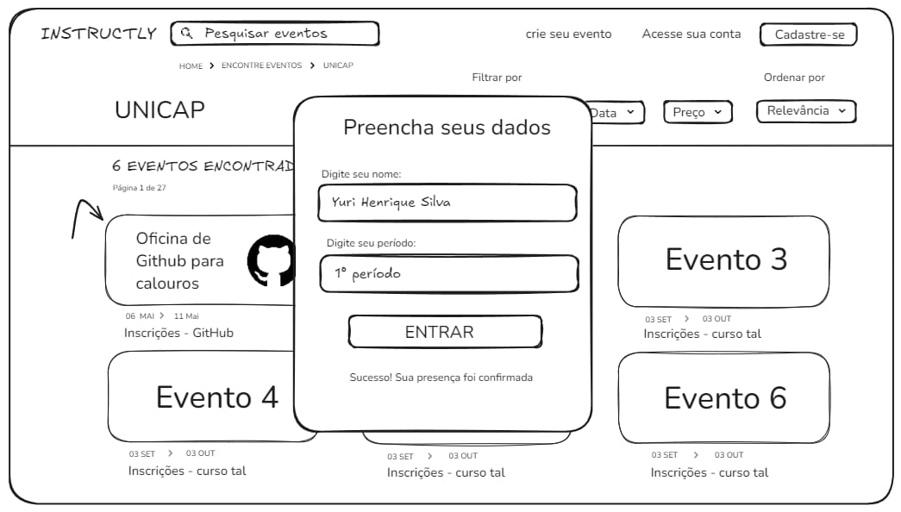
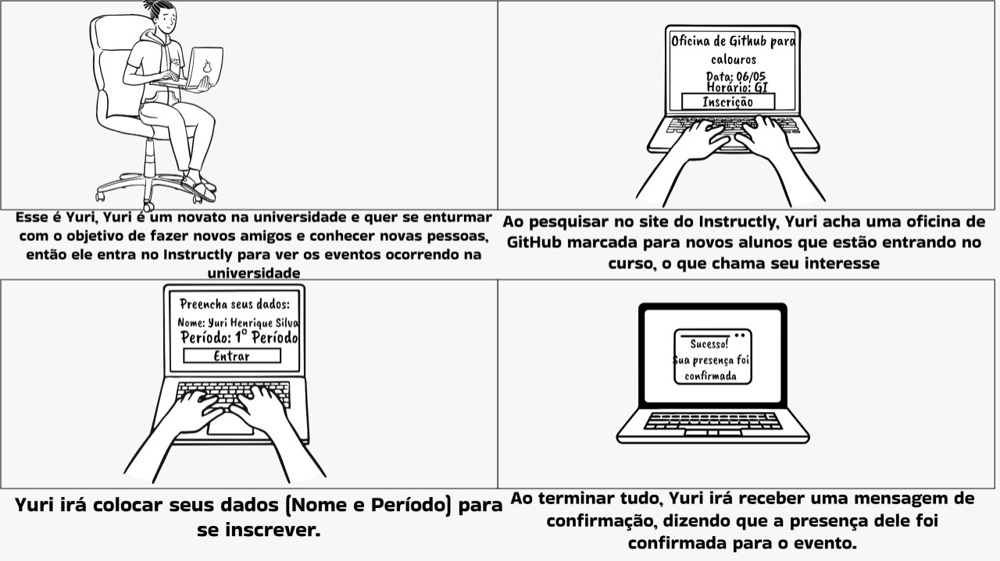
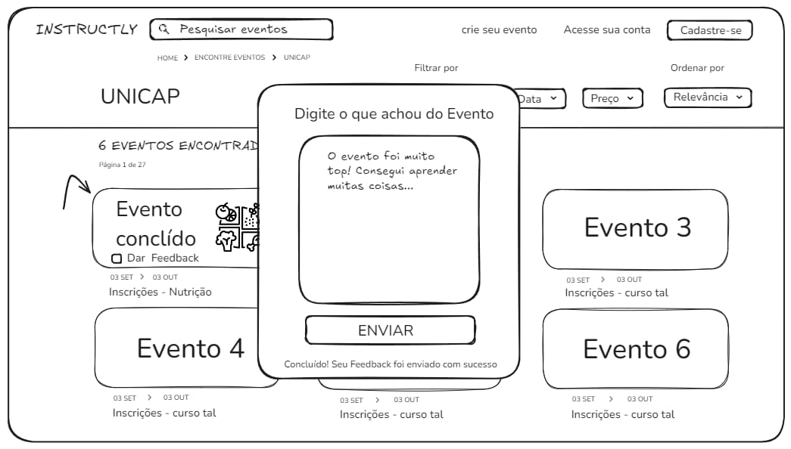
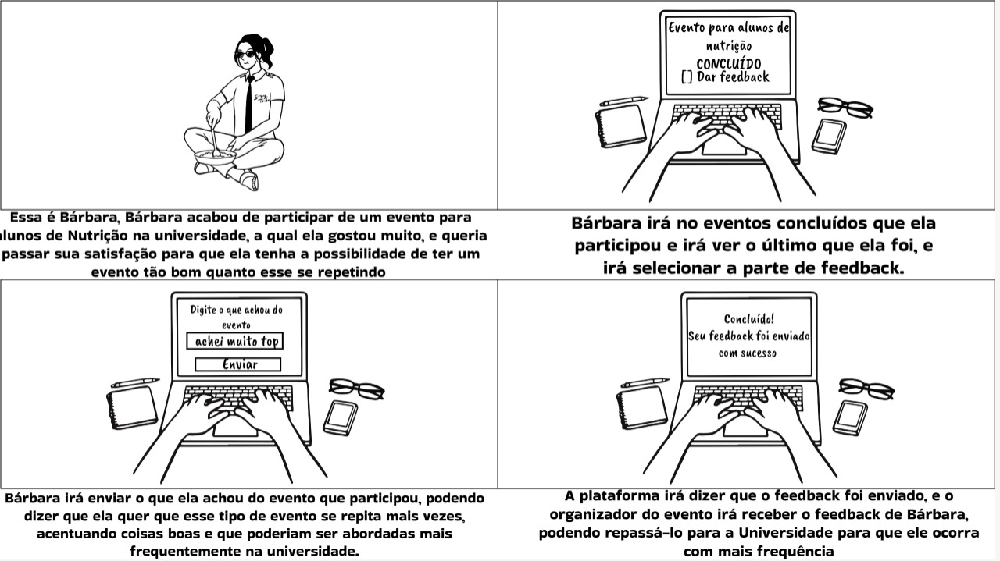
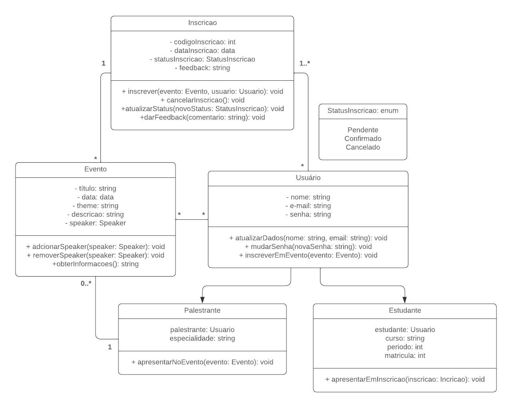
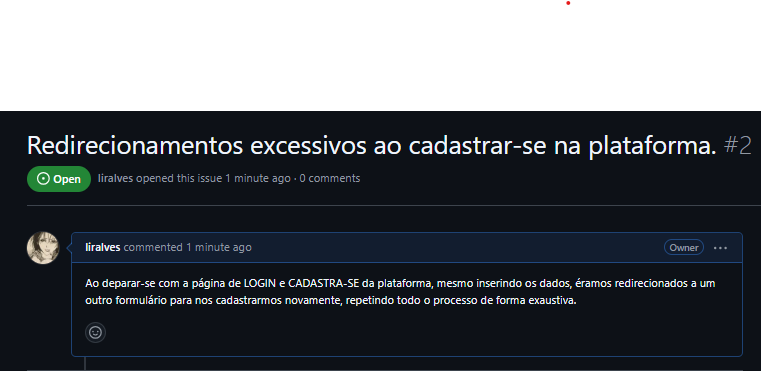

<div style="display: inline-block;">
   

 

</div>

# UNIVERSIDADE CATÓLICA DE PERNAMBUCO
<p align="center">
   
  </p>

# ÍNDICE
* [Índice](#índice)
* [Descrição do Projeto](#descrição-do-projeto)
* [Desenvolvimento do Projeto](#desenvolvimento-do-projeto)
* [Funcionalidades e Demonstração da Aplicação](#funcionalidades-e-demonstração-da-aplicação)
* [Acesso ao Projeto & Deployment](#acesso-ao-projeto-&-deployment)
* [Tecnologias utilizadas](#tecnologias-utilizadas)
* [Pessoas Contribuidoras](#pessoas-contribuidoras)
* [Pessoas Desenvolvedoras do Projeto](#pessoas-desenvolvedoras)
* [Licença](#licença)
* [Conclusão](#conclusão)

# DESCRIÇÃO DO PROJETO
<p align="justify">
INSTRUCTLYCAP é um projeto que está em desenvolvimento sob a disciplina de ANÁLISE E PROJETO DE SOFTWARE e que visa atender às necessidades específicas das instituições universitárias na organização e gestão de eventos acadêmicos e sociais. Inspirada em soluções como plataforma de gerenciamento de eventos, o projeto em desenvolvimento visa fornecer um sistema robusto e intuitivo para facilitar a administração de eventos, desde conferências e seminários até workshops e atividades extracurriculares para IES. Em suma, este projeto está sendo desenvolvido, implementado e testado para que seja eficiente e sirva como uma solução inovadora para a Universidade Católica de Pernambuco.
</p>

# DESENVOLVIMENTO DO PROJETO
### JIRA BOARD & BACKLOG
Abaixo, é possível visualizar imagens do BOARD e BACKLOG do desenvolvimento do projeto no JIRA. Pra maiores informações, acessar a [ESTRUTURA DO PROJETO]().

| IDEIA | INSTRUCTLYCAP                                                                                                                                               |
| :--: | ---------------------------------------------------------------------------------------------------------------------------------------------------------------- |
|  Centralização e Integração   | Criar um ponto único de acesso para todos os eventos da universidade.                                 |
|  Facilidade de Uso   | Oferecer uma interface amigável e intuitiva, projetada para usuários com diferentes níveis de experiência em tecnologia. |
|  Funcionalidades Específicas   | Atender às necessidades exclusivas das instituições de ensino superior.                    |
 ### BOARD JIRA
 Quadro do JIRA que, como é possível perceber, não há Sprints iniciadas. As histórias de usuários serão encontradas no quadro do backlog. Ao longo do desenvolvimento do projeto, Sprints serão criadas e implementadas de acordo com suas funcionalidades e critérios de aceitação das histórias de usuários.
     
   
  </p>
  
### BACKLOG JIRA 
<p align="justify">
   Parte do Backlog do projeto. O backlog específica todas as funcionalidades e requisitos do software que serão implementados ao longo do desenvolvimento do projeto. Existem, como vimos, as hitsórias de usuários, suas substacks e seus critérios de aceitação, que serão os requisitos a serem implementados de acordo com a história de usuário escolhida e com base nos 3 C's (Cartão, Comnversa e Confirmação)</p>
<p align="center">
   
   
</p>

### SKETCHS & STORYBOARD 

<p align="justify">
A seguir, estarão anexados os SKETCHES E STORYBOARDS das cinco primeiras histórias de usuários. <br>
A primeira SKETCH abaixo refere-se à primeira história de usuário, que, em resumo, refere-se à criação da interface de cadastro e LOGIN da plataforma em desenvolvimento.    
   
### SKETCH & STORYBOARD 01
<div style="display: inline-block;">
   
   
</div>

</div>
Dessa forma, todos os outros SKETCHES e STORYBOARDS seguirão a mesma formatação, sendo as numerações relacionadas às histórias de usuários.

### SKETCH & STORYBOARD 02
<div style="display: inline-block;">
   
   
</div>

</div>

### SKETCH & STORYBOARD 03
<div style="display: inline-block;">
   
   
</div>

</div>

### SKETCH & STORYBOARD 04
<div style="display: inline-block;">
   
   
</div>

</div>

### SKETCH & STORYBOARD 05
<div style="display: inline-block;">
   
   
   
</div>

</div>

</p>


### SCREENCAST (PROTÓTIPO) 
<p align="justify">
SCREENCAST DO PROTÓTIPO - InstructlyCAP <BR>
A gestão eficiente de eventos acadêmicos e sociais é essencial para o bom funcionamento das instituições de ensino superior. É pensando nessa necessidade que a InstructlyCAP está sendo desenvolvida, uma plataforma projetada para otimizar e simplificar a administração de eventos em universidades. Neste SCREENCAST, exploramos o protótipo FIGMA do desenvolvimento desse projeto. É possível observar o protótipo de INTERFACE das páginas de CADASTRO de um evento e eventos universitários. Essas são as interfaces principais para o desenvolvimento inicial desse projeto. 
   
Para acessar este projeto no Figma, [clique aqui.](https://www.figma.com/proto/O2XD4ivdYnsiZH6sA1UrVT/A.D.S.-%7C-Project?node-id=5-81&t=igUQKOXjtAgmoqxz-1&starting-point-node-id=5%3A81)
</p>

<p align="left">
   
</p>

### TECNOLOGIAS UTILIZADAS
As seguintes ferramentas estão atualmente sendo utilizadas na construção desse projeto:

- [Python 3.10](https://www.python.org/downloads/)
- [Pycharm Community JETBRAIN IDE](https://www.jetbrains.com/pycharm/)
- [Django Framework](https://www.djangoproject.com/start/)
- [SQLite DB Browser](https://www.sqlite.org/)
- [Bootstrap Framework](https://getbootstrap.com/)

### DIAGRA DE ATIVIDADES DO SISTEMA
<p align="justify">
   

</p>

# FUNCIONALIDADES E DEMONSTRAÇÃO DA APLICAÇÃO
### AMBIENTE DE VERSIONAMENTO | ISSUE E BUG TRACKER
<p align="justify">
No ambiente de versionamento do código, a estruturação e desenvolvimento está demonstrada através dos SHIELDS disponíveis no canto superior deste README. Ao atualizar com commits, o SHIELDS é atualizado para a sua versão de commit mais recente. Desta forma, é possível verificar a frequência de commits e atualizações deste projeto. O mesmo acontece para as atualizações de ISSUES e BUG TRACKER do sistema. A cada nova abertura de ISSUEs, o SHIELDS é atualizado para a quantidade de ISSUES abertos.  
   

</p>

### SCREENCAST DA PLATAFORMA 
<p align="justify">
Na SCREENCAST fornecida, é possível visualizar o comportamento do sistema que está sendo desenvolvido. Nele, podemos ver as implementações das três histórias de usuários da primeira SPRINT, refletindo, dessa forma, uma entrega condizente com as metas propostas.
</p>

### ACESSO AO PROJETO & DEPLOYMENT
<p align="justify"> 
   
Para obter acesso direto à hospedagem deste projeto, faremos isto através do link disponível clicando [AQUI](https://liralves.github.io/ads.github.io/). Neste link, é possível observar que a hospedagem se dá através do GitHub Pages, oferecendo um site simples mas funcional para nossos objetivos. No entanto, como ainda não temos os códigos necessários neste repositório, temos uma alternativa para acessar localmentte este projeto.

Antes de começar, você vai precisar ter instalado em sua máquina as seguintes ferramentas:
<br> [Git](https://git-scm.com),
[Python](https://www.python.org/downloads/),
[Django](https://www.djangoproject.com/start/). 
Além disto é bom ter um editor para trabalhar com o código como [VSCode](https://code.visualstudio.com/).

#### RODANDO O PROJETO LOCALMNTE (NA SUA MÁQUINA)
```
CLONE ESTE REPOSITÓRIO

$ git clone <>

```
</p>
<p align="justify">


</p>


