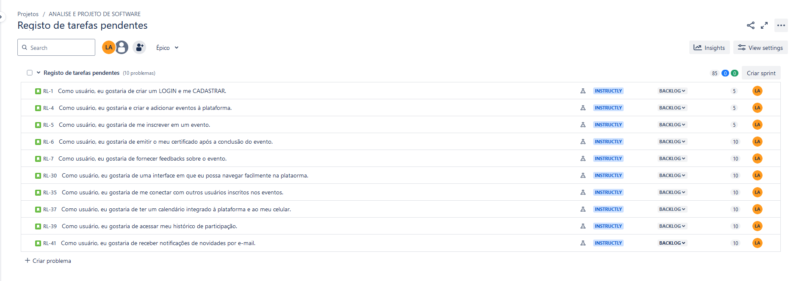

# UNIVERSIDADE CATÓLICA DE PERNAMBUCO

   
  

# ÍNDICE
* [Índice](#índice)
* [Descrição do Projeto](#descrição-do-projeto)
* [Desenvolvimento do Projeto](#desenvolvimento-do-projeto)
* [Funcionalidades e Demonstração da Aplicação](#funcionalidades-e-demonstração-da-aplicação)
* [Acesso ao Projeto](#acesso-ao-projeto)
* [Tecnologias utilizadas](#tecnologias-utilizadas)
* [Pessoas Contribuidoras](#pessoas-contribuidoras)
* [Pessoas Desenvolvedoras do Projeto](#pessoas-desenvolvedoras)
* [Licença](#licença)
* [Conclusão](#conclusão)

# DESCRIÇÃO DO PROJETO

INSTRUCTLYCAP é um projeto que está em desenvolvimento sob a disciplina de ANÁLISE E PROJETO DE SOFTWARE e que visa atender às necessidades específicas das instituições universitárias na organização e gestão de eventos acadêmicos e sociais. Inspirada em soluções como plataforma de gerenciamento de eventos, o projeto em desenvolvimento visa fornecer um sistema robusto e intuitivo para facilitar a administração de eventos, desde conferências e seminários até workshops e atividades extracurriculares para IES. Em suma, este projeto está sendo desenvolvido, implementado e testado para que seja eficiente e sirva como uma solução inovadora para a Universidade Católica de Pernambuco.

# DESENVOLVIMENTO DO PROJETO
### JIRA BOARD & BACKLOG
Abaixo, é possível visualizar imagens do BOARD e BACKLOG do desenvolvimento do projeto no JIRA. Pra maiores informações, acessar a [ESTRUTURA DO PROJETO]().

| IDEIA | INSTRUCTLYCAP                                                                                                                                               |
| :--: | ---------------------------------------------------------------------------------------------------------------------------------------------------------------- |
|  Centralização e Integração   | Criar um ponto único de acesso para todos os eventos da universidade.                                 |
|  Facilidade de Uso   | Oferecer uma interface amigável e intuitiva, projetada para usuários com diferentes níveis de experiência em tecnologia. |
|  Funcionalidades Específicas   | Atender às necessidades exclusivas das instituições de ensino superior.                    |
 ### BOARD JIRA
 Quadro do JIRA explicitando as histórias de usuários com, no mínimo 01 e no máximo 03 substacks cada. Esse metódo a ser seguido torna o projeto mais simples de ser executado e implementado.
  

   
  

  
### BACKLOG JIRA 

   Parte do Backlog do projeto. O backlog específica todas as funcionalidades e requisitos do software que serão implementados ao longo do desenvolvimento do projeto. Existem, como vimos, as hitsórias de usuários, e suas substacks, que serão os requisitos a serem           implementados de acordo com a história de usuário escolhida.

   
  

### SKETCHS & STORYBOARD 

### LICENÇA

